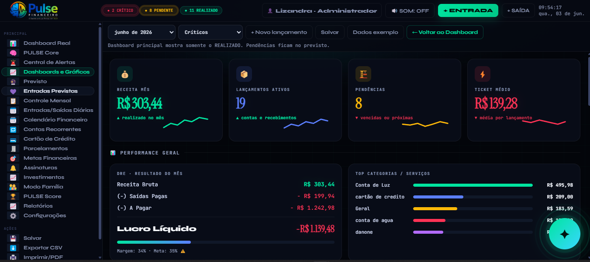
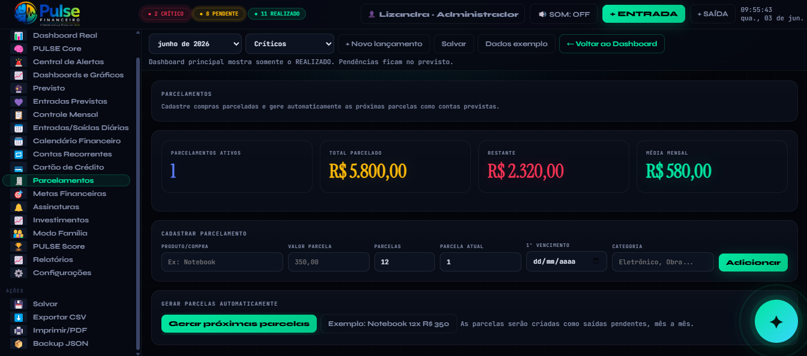
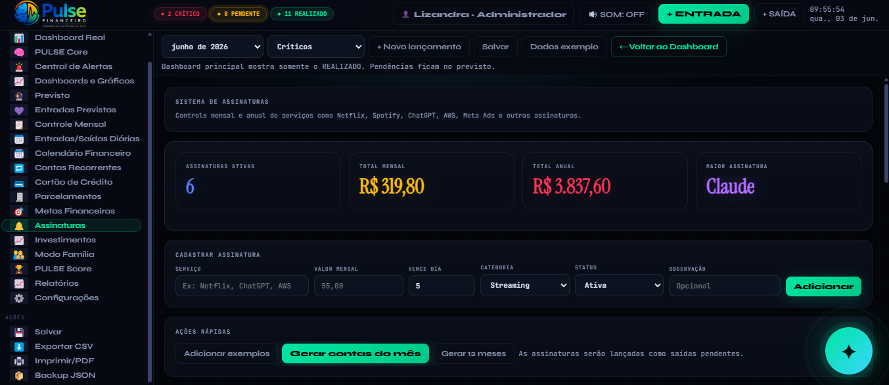
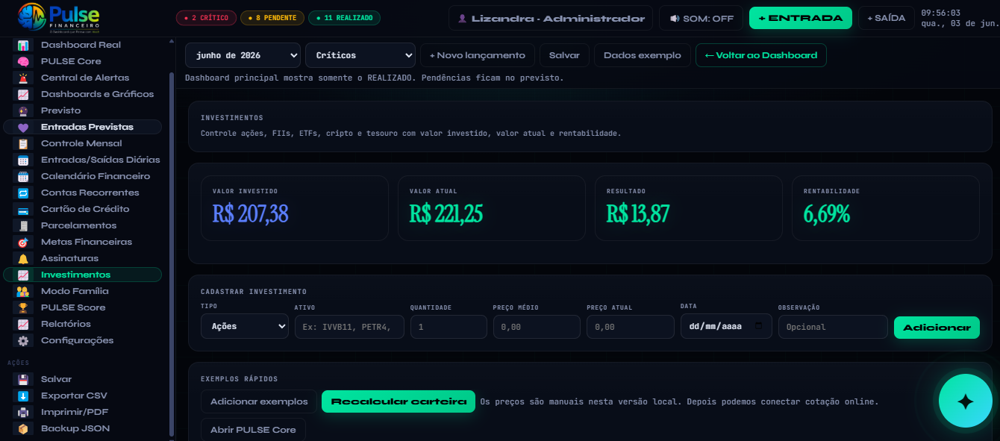

# 🚀 PULSE Financeiro

## A Inteligência Financeira que Age com Você

O PULSE Financeiro é uma plataforma de inteligência financeira pessoal desenvolvida para transformar dados financeiros em decisões mais inteligentes.

Mais do que um sistema de controle financeiro, o PULSE reúne gestão financeira, análise de dados, planejamento familiar, investimentos e inteligência artificial em uma única plataforma.

---

## 📊 Visão Geral

O objetivo do PULSE é simplificar a organização financeira através de uma experiência moderna, intuitiva e orientada por dados.

A plataforma permite acompanhar receitas, despesas, contas recorrentes, parcelamentos, investimentos, metas e indicadores financeiros em tempo real.

---

# ✨ Principais Funcionalidades

## 📈 Dashboard Financeiro Inteligente

* Visão consolidada da saúde financeira
* Receita mensal
* Despesas pagas
* Pendências
* Ticket médio
* Indicadores em tempo real

---

## 🤖 PULSE IA Financeira

Assistente financeiro inteligente capaz de responder perguntas como:

* Qual meu saldo real hoje?
* Quanto entrou este mês?
* Quais contas devo priorizar?
* Quanto posso gastar sem comprometer minhas finanças?
* Como melhorar meu score financeiro?

Respostas rápidas, objetivas e baseadas nos dados financeiros do usuário.

---

## 📅 Calendário Financeiro

Controle completo de:

* Recebimentos
* Contas a pagar
* Contas recorrentes
* Parcelamentos
* Assinaturas
* Eventos financeiros

---

## 💳 Gestão de Cartões de Crédito

* Controle de limite
* Controle de faturas
* Parcelamentos
* Projeções futuras

---

## 🔁 Contas Recorrentes

Cadastro e gerenciamento de:

* Internet
* Energia
* Água
* Condomínio
* Aluguéis
* Outros compromissos recorrentes

---

## 📦 Parcelamentos

Controle automático de:

* Quantidade de parcelas
* Valor restante
* Projeções mensais
* Geração automática de vencimentos

---

## 📺 Assinaturas

Controle de serviços recorrentes:

* Netflix
* Spotify
* ChatGPT
* Claude
* AWS
* Meta Ads
* Outros serviços

---

## 💰 Investimentos

Gestão simplificada de:

* Ações
* ETFs
* FIIs
* Tesouro Direto
* CDBs
* Criptomoedas

Com acompanhamento de:

* Valor investido
* Valor atual
* Rentabilidade
* Resultado acumulado

---

## 👨‍👩‍👧‍👦 Modo Família

Controle financeiro compartilhado entre membros da família.

Permite acompanhar:

* Receitas individuais
* Gastos individuais
* Metas individuais
* Resultado consolidado

---

## 🏆 PULSE Score

Sistema próprio de pontuação financeira.

Avalia indicadores como:

* Organização financeira
* Controle de despesas
* Saúde financeira
* Evolução patrimonial
* Cumprimento de metas

---

## 📊 Dashboards Analíticos

Visualização avançada através de:

* Fluxo de Caixa
* Distribuição de despesas
* Comparativos mensais
* Indicadores de performance

---

# 🖼️ Demonstração Visual

## Dashboard Principal

---

## Dashboards e Gráficos

---

## Contas Recorrentes

---

## Parcelamentos

---

## Assinaturas

---

## Investimentos

---

## Carteira de Investimentos

---

## Modo Família

---

# 🎯 Diferenciais

✅ Inteligência Artificial Financeira

✅ Assistente por Voz

✅ PULSE Score Exclusivo

✅ Gestão Financeira Familiar

✅ Controle de Assinaturas

✅ Controle de Parcelamentos

✅ Gestão de Investimentos

✅ Dashboards Interativos

✅ Relatórios Inteligentes

✅ Interface Premium

---

# 🛠️ Tecnologias Utilizadas

* HTML5
* CSS3
* JavaScript
* LocalStorage
* Inteligência Artificial Aplicada
* Dashboard Analytics

---

# 🚧 Roadmap

Próximas evoluções previstas:

### Curto Prazo

* Login de usuários
* Banco de dados em nuvem
* Backup automático
* Melhorias na IA Financeira

### Médio Prazo

* Aplicativo Android
* Aplicativo iOS
* Sincronização entre dispositivos
* Compartilhamento familiar avançado

### Longo Prazo

* Integração Open Finance
* Conexão bancária automática
* IA financeira avançada
* Recomendações financeiras inteligentes
* Planejamento financeiro automatizado

---

# 📈 Visão do Projeto

O PULSE Financeiro nasceu com o objetivo de ir além do simples controle financeiro.

A proposta é criar um verdadeiro assistente financeiro pessoal capaz de interpretar dados, gerar análises, sugerir prioridades e auxiliar na tomada de decisões financeiras do dia a dia.

---

# 📌 Status do Projeto

🟢 Em desenvolvimento ativo.

Este repositório contém apenas uma demonstração pública do projeto.

O código-fonte principal permanece privado.

---

# 👩‍💻 Desenvolvido por

**Lizandra Ruiz**

Estudante de Engenharia de Dados | Desenvolvimento de Produtos Digitais | Inteligência Financeira

GitHub:
https://github.com/Liza-life

---

# ⚠️ Licença

© 2026 PULSE Financeiro

Todos os direitos reservados.

Este repositório contém apenas material demonstrativo do projeto.

O código-fonte principal é privado e protegido por licença proprietária.
